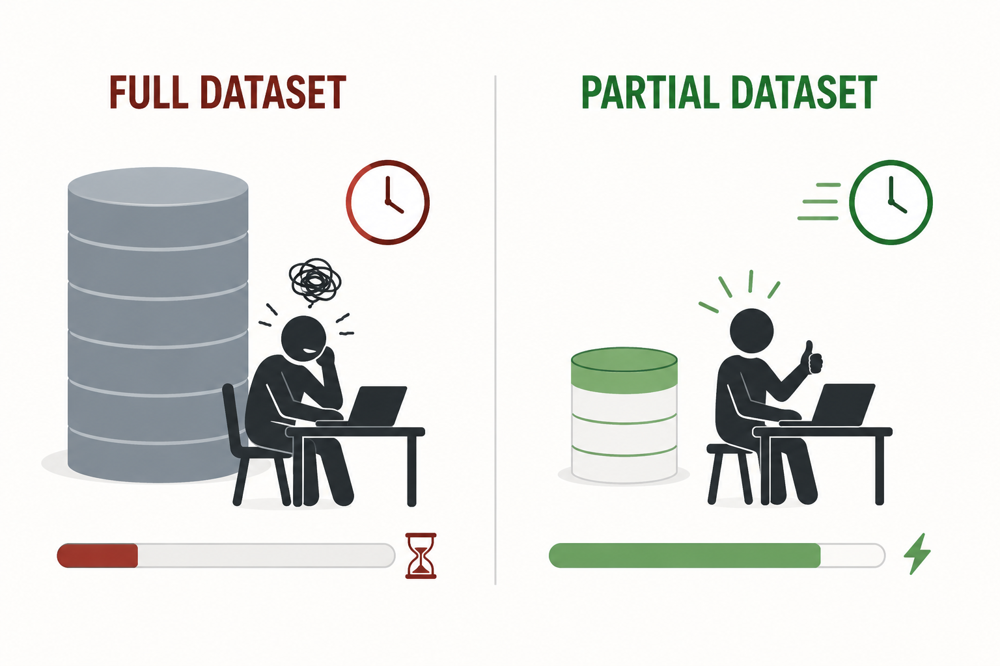

# Data-Oriented Workflow

A strategy for building and iterating on data workflows while minimizing compute time, software + data understanding, and patience.

## 1. The core idea

When a dataset is large, running an entire workflow end-to-end on the full data is slow and expensive.
Every iteration (a bug fix, a new parameter, a renamed column) costs you the full runtime again, and the feedback loop drags out until it is easy to lose the thread entirely.

The fix is simple: **get the workflow working at all on the smallest possible subset of the data, iterate on building your workflow, then scale up.**
Treat the full dataset as where the workflow becomes real, and run against it only once it is correct and stable.
This allows one to make it work, make it right, and make it fast in succession.

### 1.1 Why the order matters: the three phases mapped onto the pilot loop

That line is the well-known engineering maxim *make it work, make it right, make it fast*, and the [pilot workflow loop](#3-the-pilot-workflow-loop) maps onto it almost exactly:

- **Make it work**: get the pipeline running end-to-end on the tiny subset *at all* (step 2).
  The only goal is that every stage connects and produces output; correctness and speed are not yet in scope.
- **Make it right**: iterate against the subset until the logic is correct, then validate that the subset is representative of the full data (steps 3–4).
  Bugs are cheap to find here because each run is small.
- **Make it fast**: only now scale up to the full dataset (step 5).
  This is the one place where performance actually matters, and the logic is already stable, so that run can be spent tuning memory, I/O, and runtime rather than chasing bugs.

The phases have to happen in this order, and the pilot enforces that ordering by making each phase cheap before you commit to the next:

- If you optimize for speed **first**, you lock in incorrect logic inside expensive, hard-to-change code, and every later fix pays the full-run cost.
- If you chase correctness on the **full dataset** from the start, every bug costs a full run to find, and the feedback loop stretches out until you lose the thread (the exact failure mode [the core idea](#1-the-core-idea) warns against).

Concretely: a workflow that takes 6 hours to run end-to-end on the full data but 20 seconds on a one-plate subset lets you do ~1,000 pilot iterations in a single full-run's worth of wall-clock time.
That ratio is what turns "make it right" from an all-day ordeal into a few minutes of typing, and it is also why the subset must stay small enough to keep in memory (step 1), because once an iteration leaves the notebook session, the feedback loop snaps back open.

So the claim is not just aspirational.
The pilot loop is the mechanism by which *work → right → fast* becomes a practical sequence rather than three things you hope to do eventually: the small subset is what makes "work" cheap, the cheap iterations are what make "right" tractable, and a stable "right" is what earns you the right to spend a full run on "fast."

### 1.2 A worked example from real-world Way Lab projects

The [SK-N-AS CytoTable pilot](https://github.com/d33bs/SK-N-AS_cytotable_pilot) is a direct instance of this loop.
The source dataset is a single-plate CellProfiler SQLite export (`BR00148945.sqlite`) of roughly **62 GB**, far too large to iterate quickly on.
Instead of converting it outright, the pilot shrinks it (`make shrink`) to a one-image subset, `BR00148945_image1.sqlite`: well A01, site 1, 632 joined cell/nuclei/cytoplasm objects and their six matching source-channel TIFFs.
That subset is the smallest thing that still exercises the full conversion path, exactly as step 1 of [the pilot workflow loop](#3-the-pilot-workflow-loop) asks for.

The three phases then play out as predicted:

- **Make it work**: get [CytoTable](https://github.com/cytomining/CytoTable) running end-to-end on the subset to produce a compartments-only Parquet table (~21 seconds, without touching the 62 GB file).
- **Make it right**: verify the output row and column counts match between the serial and parallel conversion paths, so the logic is known good before a full run.
- **Make it fast**: parallelize the Iceberg export via [CytoTable PR #495](https://github.com/cytomining/CytoTable/pull/495), cutting ~55 minutes serial to ~10 minutes (~5.6×), with counts identical to the already-proven serial path.

Note what the lab did *not* do: try to optimize the 55-minute serial run first, or chase correctness against the 62 GB file.
Both would have paid full-run prices (potentially multiple times) for work that belonged in the pilot.
The subset is what made "fast" worth tuning, because "right" was already settled.

The phrasing is most commonly attributed to Stephen C. Johnson and Brian W. Kernighan who wrote *"first make it work, then make it right, and, finally, make it fast"* in a 1983 *Byte* article.
See the entries in [References and further reading](#5-references-and-further-reading).

## 2. When to apply this

Apply this approach whenever your data exceeds roughly **1 GB** or any time a single full run would take longer than you are willing to wait for an iteration.
Below that size, the feedback loop is fast enough that a pilot adds overhead without much benefit.

## 3. The pilot workflow loop

1. **Take the smallest meaningful subset.** Use a sample small enough to work with comfortably, ideally small enough to load into memory in a notebook or R/Python session, not a distributed framework. A handful of files, a single plate, one time point, or a few thousand rows is often enough. The goal is the least amount of data that still exercises every step of your workflow. It is the [stone in *Stone Soup*](https://en.wikipedia.org/wiki/Stone_Soup): it contributes almost nothing on its own, yet it makes the whole pot boil and draws the real ingredients in around it.

1. **Run the full workflow end-to-end on the subset.** Do not optimize individual steps in isolation before the whole pipeline runs. The point of the pilot is to prove the pipeline connects, not to perfect any one stage.

1. **Iterate until it works.** Fix bugs, adjust parameters, and refine outputs against the subset. Each iteration is cheap because the data is small. This is where you do the bulk of your development.

1. **Validate the subset against reality.** Before scaling up, confirm the subset is representative: compare summary statistics (mean, spread, correlation) between the sample and the full dataset where you can. A pilot built on an unrepresentative slice will mislead you at full scale.

1. **Scale up to the production data.** Once the workflow is correct and stable on the subset, run it against the full dataset. Expect this to surface scale-specific issues (memory, I/O, runtime), but logic bugs should already be behind you.

1. **Keep the pilot as an end-to-end test.** A working pilot on a tiny subset doubles as a fast regression test for future changes. Re-run it before every full-scale run to catch breakage cheaply.

## 4. Why this works

This approach is an instance of [data-oriented programming](https://blog.klipse.tech/dop/2022/06/22/principles-of-dop.html) (DOP): treat data as a first-class citizen, keep it separate from the code that operates on it, and reason about the computation through the data rather than through the code (Sharvit, 2022).
Code is easy to fixate on because it is what we write and read, but code is only a [theory about what may happen](https://pages.cs.wisc.edu/~remzi/Naur.pdf); only the data that actually flow through it prove what it does.
A pipeline that compiles, type-checks, and passes unit tests on synthetic input can still produce garbage on real data, so the work is not complete until the data are present.

The pilot loop subscribes to this by making data present early and cheaply, so it can testify before you commit to an expensive run.
A small, in-memory subset is a plain table you can eyeball, slice, summarize, and diff across runs, and step 4's check that the subset's statistics match the full dataset's is a schema check in disguise, the yardstick that lets you trust the sample as a proxy.

The upshot connects back to [why the order matters](#11-why-the-order-matters-the-three-phases-mapped-onto-the-pilot-loop): all three phases are about the code and its relationship to compute, but none of them is complete until data have run through and testified.
What differs across phases is which property of the data you are judging: that it appeared at all ("work"), that it is correct ("right"), and that it arrived within acceptable runtime, memory, and I/O at scale ("fast").
"Make it fast" comes last because its verdict is the code's cost in compute, which is only meaningful measured against the full dataset, so you earn that run only once the data have already proven the logic.

## 5. References and further reading

- [Make It Run, Make It Right](https://newsletter.kentbeck.com/p/make-it-run-make-it-right) and [Make It Run, Make It Right II](https://newsletter.kentbeck.com/p/make-it-run-make-it-right-ii): Kent Beck on the maxim he traces to his father, and its connection to TDD ("write a test, make it run, make it right").
- Johnson, S. C. & Kernighan, B. W., "The C Language and Models for Systems Programming," *Byte* magazine, August 1983, the earliest printed form of the maxim: *"first make it work, then make it right, and, finally, make it fast."*
- [Principles of Data-Oriented Programming](https://blog.klipse.tech/dop/2022/06/22/principles-of-dop.html): the four principles of treating data as a first-class citizen (Yehonathan Sharvit).
- [Big data workflow (Spark)](https://best-practice-and-impact.github.io/ons-spark/spark-analysis/big-data-workflow.html): the UK Office for National Statistics on why most analysis stages should _not_ run on the full dataset, and how to work with samples.
- [SK-N-AS CytoTable pilot](https://github.com/d33bs/SK-N-AS_cytotable_pilot), this lab's own [worked example](#12-a-worked-example-from-this-lab): shrinking a 62 GB CellProfiler SQLite export to a one-image subset before converting and parallelizing with [CytoTable](https://github.com/cytomining/CytoTable).
- [*Stone Soup* (folktale)](https://en.wikipedia.org/wiki/Stone_Soup): the stone is the smallest subset that still makes the whole pipeline run, with the real ingredients drawn in around it.
