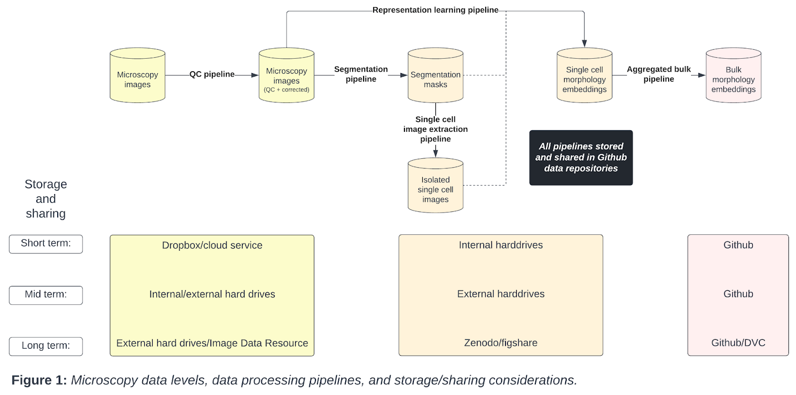
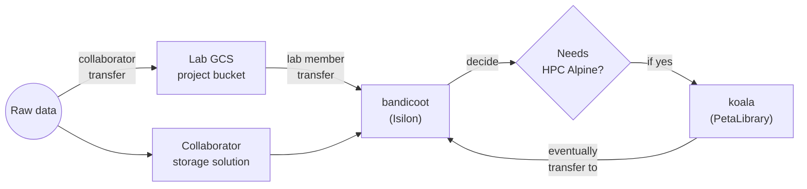

# Data Strategy

A suitable and flexible data management plan is essential for effective and trustworthy science.
Our goals with this strategy is to maximize access, understanding, analysis speed, and provenance while reducing access barriers, unnecessary storage bloat, and cost.

## 1. Data perspectives

We think of data from three different perspectives:

1. Level

1. Origin

1. Flow

Each perspective requires different considerations for storage, access, and provenance management.
Management practices for microscopy images are related to other data types, with some nuance.

### Level

Your data level indicates the processing stage.
For example, the lowest data level, or “raw” data, are the images acquired by the microscope.
Technically, the biological substrate is the “rawest” data, but we consider the digitization of biological data to be the lowest level.

With biological data, there are many different kinds of intermediate data.
Intermediate data are typically different sizes and thus have different storage requirements.
Each intermediate data type requires unique considerations for access frequency, dissemination, and versioning.

### Origin

Where your data come from also requires unique management policies.
We use data originating from collaborators (both academic and industry) and data already in the public domain.
Eventually, we will use data that we ourselves collect, but for the moment, we can ignore this origin category.

We need to consider access requirements and restrictions, particularly when using collaborator data.
When storing restricted data, it is helpful to remember that all data will eventually be in the public domain.

### Flow

Besides the most raw form, data are dynamic and pluripotent; always awaiting new and improved processing capabilities.
We need to understand how each specific data level was processed at the specific moment in time (data provenance), and where each data level is ultimately heading for longer term storage.
We also need capabilities to quickly reprocess these data with new approaches.
Consider each data processing step as a new research project, waiting for improvement.

Flow also refers to users and data demand.
We need to consider data analysis activity at each particular moment.
For example, if the data are actively being worked on, multiple people should have immediate access.
We need to align data access demand with storage solutions and computability.

## 2. Storage solutions

We consider the following categories of potential storage solutions for data:

1. Lab storage

   1. Internal hard drive

   1. External hard drive

1. Campus storage

   1. CU Anschutz - Dell PowerScale (Isilon)
   1. CU Boulder Research Computing - PetaLibrary
   1. CU Boulder Research Computing - High-performance Computing (HPC) Cluster Alpine

1. External storage

   1. Image Data Resource (IDR)

   1. Amazon S3 / Google Cloud Storage Buckets / Azure Blob Storage

   1. Figshare / Figshare+

   1. Zenodo

   1. Github

   1. Git Large File Storage (LFS)

   1. Data Version Control (DVC)

   1. OneDrive / Dropbox / Google drive

Each storage solution has trade-offs in terms of longevity, access, usage speed, version control, size restrictions, and cost (**Table 1**).

## 3. Microscopy Data Levels

From the raw microscopy image to the variable intermediate data types including single cell and bulk embeddings, each data level has unique data storage considerations (**Figure 1**).

Starting with microscopy images, we apply a quality control (QC) pipeline to select and correct microscopy images for downstream analysis.
Next, we apply segmentation pipelines to isolate individual single cells, which form segmentation masks.
We have the option to apply a single cell image extraction pipeline to form a dataset of isolated single cell images.
We apply representation learning pipelines to extract morphology features from some combination of the corrected microscopy image, segmentation mask, or isolated single cell images.
Finally, we apply an aggregated bulk pipeline to turn the single cell morphology embeddings into aggregated bulk embeddings.
Importantly, we have different short, mid, and long term storage and sharing solutions for each data type.

| **Category**     | **Solution**                                                                           | **Longevity** | **Version Control** | **Access**     | **Usage speed** | **Size limits**                                                                                                                              | **Cost**                                                                                                                                                             | **Notes**                                                                                                                        |
| ---------------- | -------------------------------------------------------------------------------------- | ------------- | ------------------- | -------------- | --------------- | -------------------------------------------------------------------------------------------------------------------------------------------- | -------------------------------------------------------------------------------------------------------------------------------------------------------------------- | -------------------------------------------------------------------------------------------------------------------------------- |
| Lab storage      | [Internal hard drive](https://www.dpbestflow.org/data-storage-hardware/hard-drive-101) | Intermediate  | No                  | Private        | Instant         | \<= 18TB (Total)                                                                                                                             | ~$15 per TB one time cost ([Details](https://diskprices.com/))                                                                                                       |                                                                                                                                  |
| Lab storage      | External hard drive                                                                    | High          | No                  | Private        | Download        | \<= 18TB (Total)                                                                                                                             | ~$15 per TB one time cost ([Details](https://diskprices.com/))                                                                                                       |                                                                                                                                  |
| Campus storage   | CU Anschutz - Dell PowerScale (Isilon)                                                 | High          | No                  | Private        | Instant         | Pay per use                                                                                                                                  | $0.016 per GB per month                                                                                                                                              | [See rates here](https://www.cuanschutz.edu/offices/office-of-information-technology/tools-services/storage-servers-and-backups) |
| Campus storage   | CU Boulder Research Computing - PetaLibrary                                            | High          | No                  | Private        | Instant         | Purchased by Petabyte per year                                                                                                               | $70/TB/yr (Active + Archive)                                                                                                                                         | [See rates here](https://www.colorado.edu/rc/resources/petalibrary/storageandrates)                                              |
| Campus storage   | CU Boulder Research Computing - HPC Cluster Alpine                                     | Low           | No                  | Private        | Instant         |                                                                                                                                              |                                                                                                                                                                      |                                                                                                                                  |
| External storage | [IDR](https://idr.openmicroscopy.org/)                                                 | High          | Yes                 | Public         | Download        | >= 2TB (Per dataset)                                                                                                                         | Free                                                                                                                                                                 |                                                                                                                                  |
| External storage | Amazon S3 / Google Cloud Storage Buckets / Azure Blob Storage                          | Low           | Yes                 | Public/Private | Instant         | >= 2TB (Per dataset)                                                                                                                         | $0.02 - $0.04 per GB / Month ($40 to $80 per month per 2TB dataset)                                                                                                  |                                                                                                                                  |
| External storage | [Figshare](https://figshare.com/)                                                      | High          | Yes                 | Public         | Download        | 20GB (Total)                                                                                                                                 | Free ([Details](https://help.figshare.com/article/figshare-account-limits))                                                                                          |                                                                                                                                  |
| External storage | [Figshare+](https://knowledge.figshare.com/plus)                                       | High          | Yes                 | Public         | Download        | 250GB > x > 5TB (Per dataset)                                                                                                                | $745 > x > $11,860 one time cost ([Details](https://knowledge.figshare.com/plus))                                                                                    |                                                                                                                                  |
| External storage | [Zenodo](https://zenodo.org/)                                                          | High          | Yes                 | Public         | Download        | >= 50GB (Per dataset)                                                                                                                        | Free ([Details](https://help.zenodo.org/))                                                                                                                           |                                                                                                                                  |
| External storage | Github                                                                                 | High          | Yes                 | Public/Private | Instant         | >= 100MB (Per file) ([Details](https://docs.github.com/en/repositories/working-with-files/managing-large-files/about-large-files-on-github)) | Free                                                                                                                                                                 |                                                                                                                                  |
| External storage | Git LFS (GitHub)                                                                       | Intermediate  | Yes                 | Public/Private | Instant         | >= 2GB (up to 5GB for paid plans)                                                                                                            | 50GB data pack for $5 per month ([Details](https://docs.github.com/en/billing/managing-billing-for-git-large-file-storage/about-billing-for-git-large-file-storage)) |                                                                                                                                  |
| External storage | DVC                                                                                    | Intermediate  | Yes                 | Public/Private | Download        | None                                                                                                                                         | Cost of linked service (AWS/Azure/GC)                                                                                                                                |                                                                                                                                  |
| External storage | OneDrive                                                                               | Low           | Yes                 | Private        | Instant         | >= 5TB (Total)                                                                                                                               | Free to AMC                                                                                                                                                          |                                                                                                                                  |
| External storage | Dropbox                                                                                | Low           | Yes                 | Public/Private | Instant         | >= 5TB (Total)                                                                                                                               | $12.50 per user / month ([Details](https://www.dropbox.com/plans))                                                                                                   |                                                                                                                                  |
| External storage | Google Drive                                                                           | Low           | Yes                 | Public/Private | Instant         | >= 5TB (Total)                                                                                                                               | $25 per month ([Details](https://one.google.com/about/plans))                                                                                                        |                                                                                                                                  |

**Table 1**: Tradeoffs and considerations for data storage solutions.

## 4. Shared Data Storage Solutions

The lab uses tree-dwelling marsupial names for specific shared storage solutions except project-specific storage.
When a new storage solution is acquired for use we suggest abiding this naming pattern.

| **name**                | **category**     | **solution**                                | **suggested use**                                                                                                                                                                                                                                         | **interface**                                                                                                                     |
| ----------------------- | ---------------- | ------------------------------------------- | --------------------------------------------------------------------------------------------------------------------------------------------------------------------------------------------------------------------------------------------------------- | --------------------------------------------------------------------------------------------------------------------------------- |
| `kinkajou`              | Lab storage      | External hard drive                         | Local storage for occasion where other campus or external storage solutions will not work well.                                                                                                                                                           | Filesystem mounts                                                                                                                 |
| `bandicoot`             | Campus storage   | CU Anschutz - Dell PowerScale (Isilon)      | NAS-like storage solution for primary shared use within the lab. Can be mounted to local filesystems or use S3-like object storage API access. [See demonstration repository for more information](https://github.com/WayScience/demo-uca-isilon-python). | Filesystem mounts, [rclone](https://rclone.org/), S3-like object storage API's(enabled at the request of CU Anschutz IT requests) |
| `koala`                 | Campus storage   | CU Boulder Research Computing - PetaLibrary | Used for interacting with large amounts of data on CU Boulder Research Computing - HPC Cluster Alpine (`bandicoot` is not accessible from Alpine).                                                                                                        | [Globus Connect Personal](https://www.globus.org/globus-connect-personal), filesystem mount (HPC Alpine)                          |
| `<project name>-bucket` | External storage | Google Cloud Storage Buckets                | Used for receiving data from external collaborators. Reference [gc-cloud-storage-bucket](https://github.com/CU-DBMI/gc-cloud-storage-bucket) as a template or example.                                                                                    | [gsutil](https://cloud.google.com/storage/docs/gsutil), [rclone](https://rclone.org/), S3-like object storage API's               |

**Table 2.** Current storage solutions used by the lab along with their suggested use and interface.

Consider the following data flow for projects to better understand how each of Table 2's data solutions fit together.

**Figure 1.** Raw data is received by the lab from Google Cloud Storage (GCS) project-specific buckets or a collaborator storage solution which is provided upfront. A lab member then transfers the data from the GCS bucket or collaborator storage solution to bandicoot (Isilon) so it may be used or shared within the lab. If the data need to be processed on HPC Alpine a lab member may decide to transfer the data to koala (PetaLibrary). Once HPC Alpine processing is complete the data are transferred back to bandicoot.
